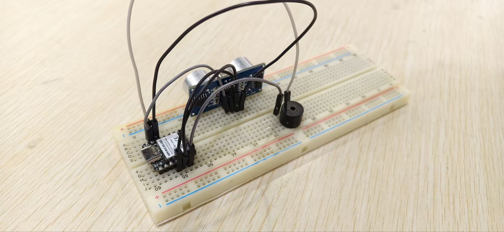
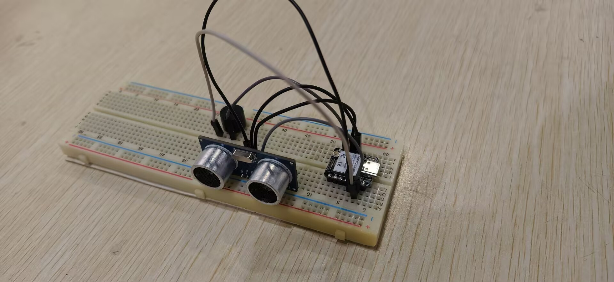
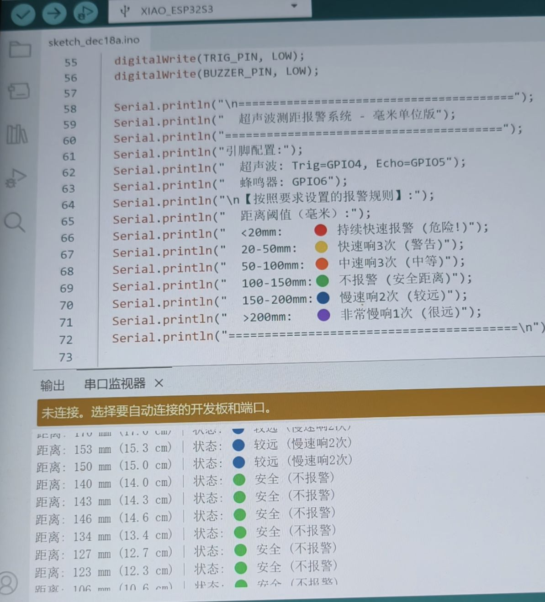
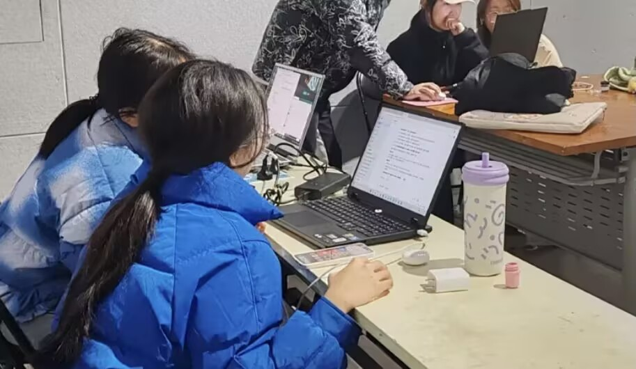

# 超声测距管片拼装辅助系统

## 一、项目介绍

### 1. 项目背景
随着全球城市化进程的加快与地下空间开发需求的持续增长，盾构法隧道工程已成为地铁、管廊、水利隧道等基础设施建设的核心技术。作为隧道衬砌的关键结构，盾构管片在拼装过程中的质量直接决定了隧道整体的结构安全、长期防水性与几何线形精度。然而，目前盾构机管片安装施工环节仍依赖人工目测进行精度把控，单片管片安装耗时通常达7-8分钟；且人工操作易产生较大安装偏差，进一步延长施工周期、降低作业效率。此外，梯形块安装对操作人员的技术熟练度要求极高，若定位或受力控制不当，极易引发管片爆裂、止水带挤出等安全隐患，严重影响施工质量与进度。

### 2. 目标人群
盾构机管片安装工程人员

### 3. 解决的问题
- 拼装精度控制难
- 自动化与智能化程度低
- 人员技能参差不齐
- 现场管控盲区

### 4. 创新点
本项目开发的超声波测距管片安装辅助系统，核心采用设定标准数据，致力于让安装更加规范化、精确度更高，并且能够缩短安装时间，减少人力消耗。具体将基于 XIAO ESP32开发板，搭配超声波测距模块、数据处理及显示模块，设计一款可集成于盾构机液压臂的便携测量工具，通过实时精准采集并反馈管片安装过程中的距离参数，辅助施工人员进行安装定位，最终实现减少人工依赖、缩短施工耗时、降低安全风险的目标。
## 二、主要功能

### 核心功能
利用超声波测距监测管片安装时的缝隙，减少安装时间，降低人为误差率，提高安装效率与精度

## 三、工作原理
- 利用超声波传感器精确测量新管片与相邻块在关键点（如接缝处）的距离差。
- 利用有源蜂鸣器在测量值超限时立即发出不同频率的警报（例如：长鸣表示错台过大，短促鸣叫表示缝隙不均）。
- 利用XIAO ESP32在每次测量后，自动记录时间、环号、错台量、缝隙值等关键数据。

## 四、所需组件

### （一）硬件模块
| 组件名称 | 型号/规格 | 数量 | 功能说明 |
|---------|----------|------|---------|
| 主控开发板 | XIAO ESP32 | 1个 | 核心控制器 |
| 超声波测距 | HC-SR04 | 1个 | 距离检测 |
| 有源蜂鸣器 | 5V | 1个 | 提示报警 |
| 面包板 | 800孔 | 1个 | 连接器材 |
| 杜邦线 | 公对公 | 6根 | 连接器材 |

### （二）软件模块
- Arduino IDE：用于ESP32的开发和烧录
- 开发板管理器：esp32 by Espressif Systems
- github：用于开发板管理库的下载
- 管理库：Adafruit VL53L0X by Adafruit

## 五、构建步骤

### （一）硬件连接
- **【超声波传感器】→【XIAO ESP32】**
  - VCC引脚→3.3V
  - GND引脚→GND
  - Echo引脚→D3
  - Trig引脚→D4

- **【有源蜂鸣器】→【XIAO ESP32】**
  - VCC引脚→D5
  - I/O引脚→GND

### （二）软件配置

#### 步骤1：添加ESP32支持
1. 打开Arduino IDE
2. 文件→首选项
3. 在"附加开发板管理器网址"中添加：
   https://espressif.github.io/arduino-esp32/package_esp32_index.json
4. 点击确定

#### 步骤2：安装开发板和库
1. 工具→开发板→开发板管理器。搜索"ESP32"→安装"esp32 by Espressif Systems"
2. 工具→管理库。搜索"VL53L0X"→安装"Adafruit VL53L0X by Adafruit"

#### 步骤3：选择开发板和端口
1. 工具→开发板→选择"Seed XIAO ESP32S3"
2. 工具→端口→选择出现的COM口

### （三）程序烧录

#### 完整代码
```cpp
// 项目名称：超声测距管片拼装辅助系统
// 硬件：XIAO ESP32 + HC-SR04超声波传感器 + 5V有源蜂鸣器

// 引脚定义
const int trigPin = 4;  // Trig引脚接D4
const int echoPin = 3;  // Echo引脚接D3
const int buzzerPin = 5;  // 蜂鸣器VCC引脚接D5

// 常量定义
const float SOUND_SPEED = 0.034;  // 声速(cm/μs)
const long MEASURE_INTERVAL = 500;  // 测量间隔(ms)

// 报警阈值（可根据实际需求调整）
const float MAX_GAP_THRESHOLD = 5.0;  // 最大允许缝隙(cm)
const float UNEVEN_THRESHOLD = 2.0;   // 缝隙不均阈值(cm)

// 变量定义
long duration;
float distance;
float lastDistance = 0;
unsigned long lastMeasureTime = 0;

void setup() {
  // 初始化串口通信
  Serial.begin(115200);
  
  // 初始化引脚
  pinMode(trigPin, OUTPUT);
  pinMode(echoPin, INPUT);
  pinMode(buzzerPin, OUTPUT);
  
  // 初始状态下关闭蜂鸣器
  digitalWrite(buzzerPin, LOW);
  
  // 输出初始信息
  Serial.println("超声测距管片拼装辅助系统启动");
  Serial.println("----------------------------------");
  Serial.println("时间,环号,错台量,缝隙值");
}

void loop() {
  // 定时测量
  if (millis() - lastMeasureTime >= MEASURE_INTERVAL) {
    lastMeasureTime = millis();
    
    // 测量距离
    distance = measureDistance();
    
    // 数据记录
    recordData(distance);
    
    // 报警判断
    checkAlarm(distance);
    
    // 更新上一次测量值
    lastDistance = distance;
  }
}

// 测量距离函数
float measureDistance() {
  // 发送10μs的触发脉冲
  digitalWrite(trigPin, LOW);
  delayMicroseconds(2);
  digitalWrite(trigPin, HIGH);
  delayMicroseconds(10);
  digitalWrite(trigPin, LOW);
  
  // 读取回波时间
  duration = pulseIn(echoPin, HIGH);
  
  // 计算距离(cm)
  distance = duration * SOUND_SPEED / 2;
  
  // 过滤异常值
  if (distance > 400 || distance < 2) {
    distance = -1;
  }
  
  return distance;
}

// 数据记录函数
void recordData(float distance) {
  // 获取当前时间（简化处理，实际可使用RTC模块）
  unsigned long currentTime = millis();
  
  // 假设环号为1（实际可通过按钮或输入设置）
  int ringNumber = 1;
  
  // 错台量计算（简化处理，实际需多传感器测量）
  float stagger = 0;
  if (lastDistance > 0 && distance > 0) {
    stagger = abs(distance - lastDistance);
  }
  
  // 输出数据到串口（CSV格式）
  Serial.print(currentTime);
  Serial.print(",");
  Serial.print(ringNumber);
  Serial.print(",");
  Serial.print(stagger, 2);
  Serial.print(",");
  if (distance > 0) {
    Serial.println(distance, 2);
  } else {
    Serial.println("-1");
  }
  
  // 实际应用中可添加存储到SD卡的功能
}

// 报警判断函数
void checkAlarm(float distance) {
  // 无效测量值不报警
  if (distance < 0) {
    digitalWrite(buzzerPin, LOW);
    return;
  }
  
  // 缝隙过大报警（长鸣）
  if (distance > MAX_GAP_THRESHOLD) {
    digitalWrite(buzzerPin, HIGH);
    delay(500);
    digitalWrite(buzzerPin, LOW);
    delay(100);
    digitalWrite(buzzerPin, HIGH);
    delay(500);
    digitalWrite(buzzerPin, LOW);
    return;
  }
  
  // 缝隙不均报警（短促鸣响）
  if (lastDistance > 0 && abs(distance - lastDistance) > UNEVEN_THRESHOLD) {
    for (int i = 0; i < 3; i++) {
      digitalWrite(buzzerPin, HIGH);
      delay(100);
      digitalWrite(buzzerPin, LOW);
      delay(100);
    }
    return;
  }
  
  // 正常状态，关闭蜂鸣器
  digitalWrite(buzzerPin, LOW);
}
```

## 六、未来展望

基于项目当前进展，未来将围绕以下几个具体方向进行优化改进，提升系统的工程实用性和智能化水平：

### 1. 错台记录功能优化
实现自动记录当前环与相邻环管片的错台量，通过数据处理算法计算错台偏差值，并将错台数据与缝隙值同时存储，为后续施工质量分析提供更全面的数据支持。

### 2. 激光测距技术升级
将超声波传感器升级为激光测距传感器（如VL53L0X），提升测量精度与抗干扰能力，尤其在粉尘较多的隧道施工环境中，激光测距具有更好的稳定性和可靠性。

### 3. 语音与LED双提示报警
增加语音模块与LED指示灯，实现语音提示（如"缝隙过大"、"错台超标"）与不同颜色LED灯光报警的双重提醒功能，进一步降低操作人员的认知负荷。

### 4. 防护外壳设计
开发防水、防震的专用防护外壳，确保设备在隧道内恶劣施工环境下仍能稳定运行，延长设备使用寿命，提高系统的可靠性和耐用性。

展望未来，该系统将从单一的"测距报警工具"，逐步发展为功能更完善、性能更稳定、操作更便捷的智能拼装辅助设备，为盾构隧道施工提供更有力的技术支持。

## 七、图片展示

### 1. 硬件连接图



### 3. 串口输出数据


### 4. 团队协作照片



## 八、项目贡献者

| 姓名 | 职责 |
|------|------|
| 万心怡 | 项目方案、软件开发及程序烧录 |
| 李依凡 | 项目方案、硬件连接 |