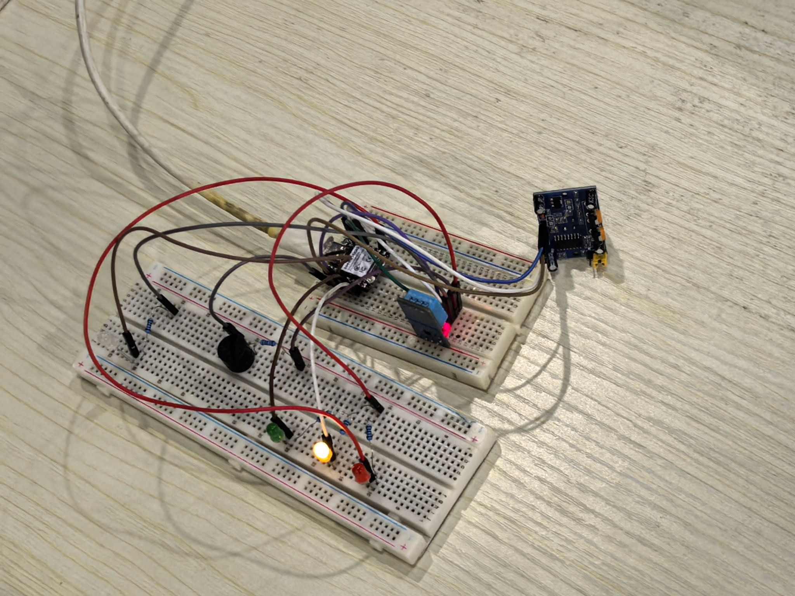
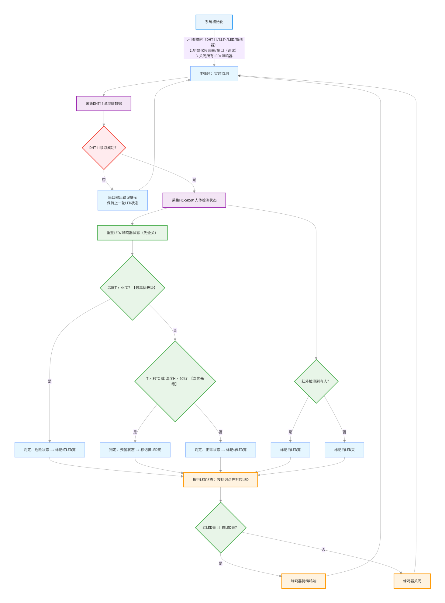
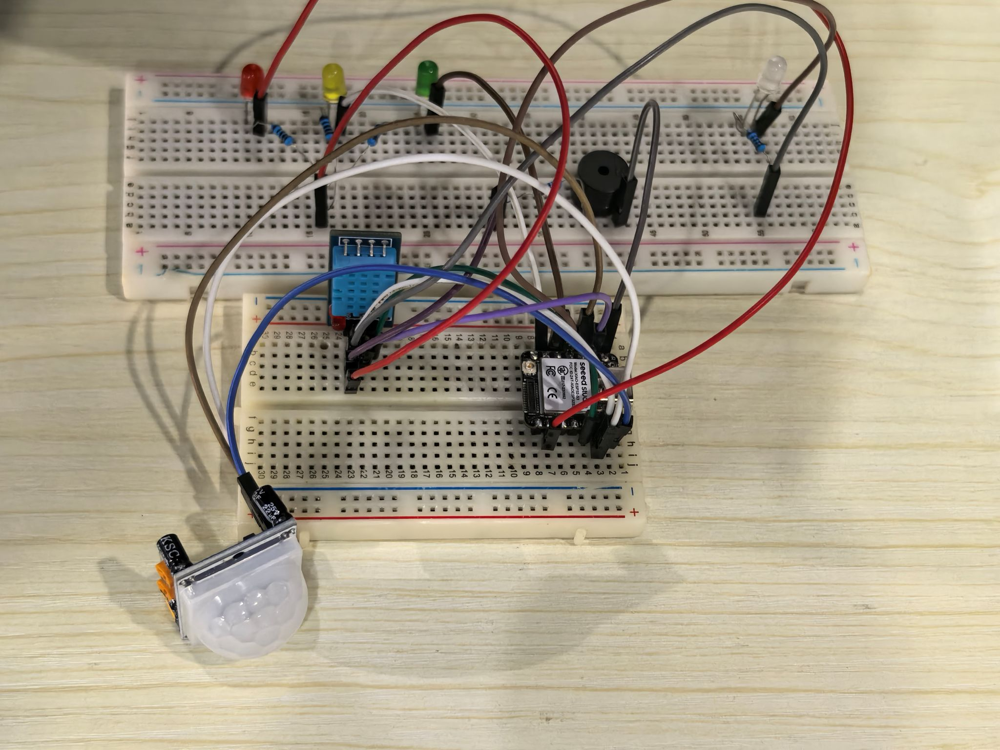
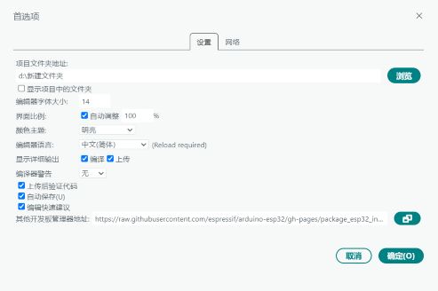
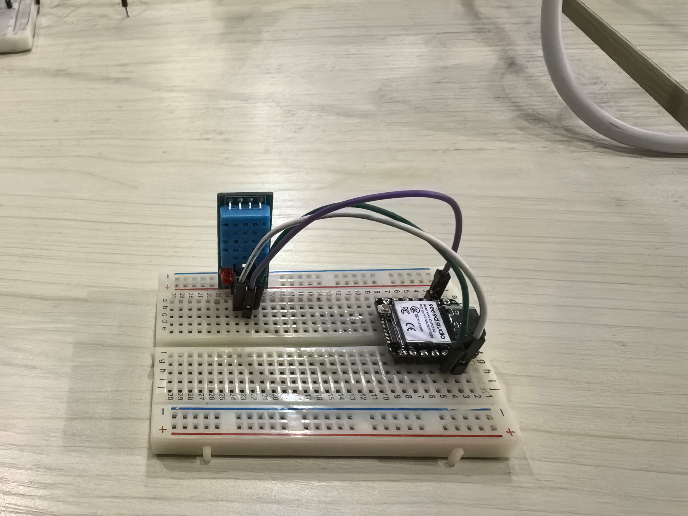
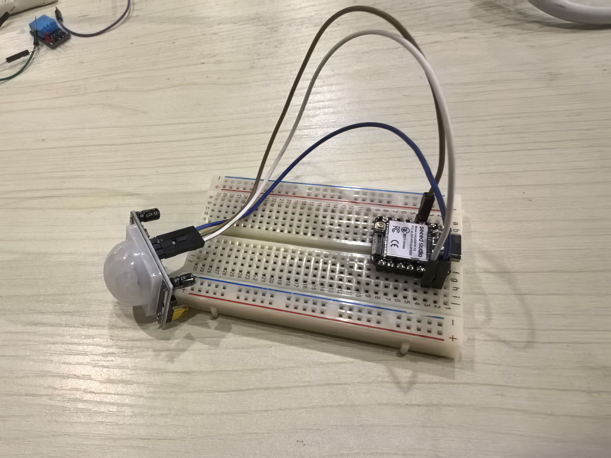
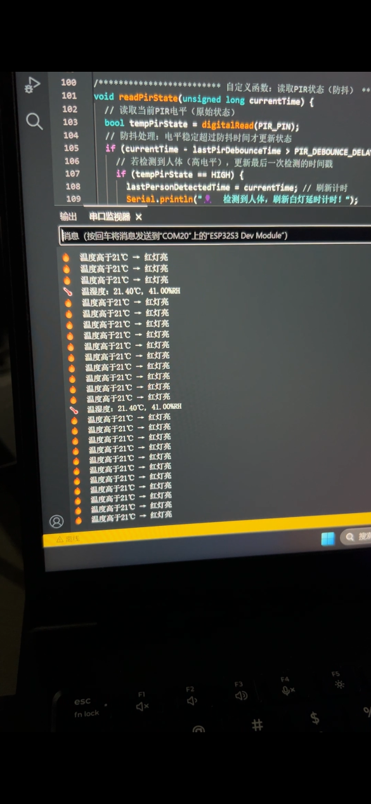

# 便携集成式盾构施工安全监测装置

## 一、项目介绍

- **项目背景、目标人群及解决的问题**：盾构机是城市轨道交通、地下管廊、越江隧道等重大地下工程的核心装备，其工作舱是集设备运行、人员操作、维护管控于一体的核心密闭空间，该空间的环境稳定性与人员管理效率直接决定施工安全、设备寿命与工程进度。受舱内多台电机持续高负荷运转产热、地质层包裹导致自然散热失效的双重影响，舱内温度呈现显著梯度变化特征。同时，地下施工环境的水汽渗透使舱内湿度常年维持≥85%RH的高湿状态，极易引发电路板凝露、触点锈蚀，进而导致短路故障甚至火灾、触电等重大安全事故。尤为关键的是，人舱作为人员与设备高频交互区域，传统管理模式下人员进出状态与环境数据完全脱节，易出现 "高温环境下人员滞留未预警" "设备异常时人员误入" 等管控漏洞，形成环境风险与人员风险叠加的安全盲区。为此，本项目基于Seed Studio XIAO ESP32S3 Sense开发板，构建了一套完整的环境温湿度及人员安全监测系统。该系统集成了温度监测、实时人员监控等功能，结合Arduino IDE平台，无需复杂编程，即可快速实现智能监测环境温湿度和人员安全功能。

- **创新点**：(1)可分级预警。(2)体积小、成本低。(3)对应传感器精准报警。(4)分级预警和人员检测联动。

- **系统整体照片**：



## 二、主要功能

- 智能温湿度数据监测与采集
- 人员实时检测与反馈
- 高温环境下人员滞留预警

## 三、工作原理

- 基于XIAO ESP32S3开发板，通过引脚主要连接了DHT11温湿度传感器和HC-SR501红外传感器，再利用Arduino IDE进行模块开发，实现以下功能：
  
  - 对于温湿度传感器：实时采集环境中温湿度数据。当温度≤39°C且湿度≤60%时为正常数值，此时绿色LED灯亮起；当温度>39°C但≤44°C，或湿度>60%时为高温情况，此时黄色LED灯亮起，开始预警；当温度>44°C时为危险情况，此时红色LED灯亮起，提示人员需紧急撤离。其中温度LED灯更换优先级高于温度。
  
  - 对于红外传感器：实时检测人员存在情况。无人情况白色LED熄灭，检测到人时白色LED灯亮起。
  
  - 两个传感器联动：当红色LED和白色LED同时亮起，即温度>44°C达到危险情况且有人存在时，蜂鸣器响起，及时给出提示警报。
  
  - 流程图：



## 四、所需组件

### (一) 硬件模块

- **内容要求**：列出所有使用的硬件组件。
- **格式要求**：使用表格，包含 "组件名称、型号/规格、数量、功能说明" 四列。
- **要求**：需提供一张所有硬件摆放在一起的清晰照片。

#### 使用硬件表格

| 组件名称 | 型号/规格 | 数量 | 功能说明 |
|---------|---------|------|---------|
| 主控开发板 | Seed Studio XIAO ESP32S3 Sense | 1 | 核心控制器 |
| 红外传感器 | HC-SR501 | 1 | 检测人员存在情况 |
| 温湿度传感器 | DHT11 | 1 | 检测环境温湿度 |
| LED灯 | 5F-R、5F-Y、5F-G、5F-W | 4 | 温湿度或人员预警提示 |
| 蜂鸣器 | FMQ-270 | 1 | 联动报警 |
| 电阻 | 220V | 5 | 防止硬件烧坏 |
| 面包板/杜邦线 | - | 若干 | 连接线材 |

(以下为包含所有硬件的图片)



### (二) 软件模块

- Arduino IDE：用于ESP32固件开发和烧录；
- 库：Grove_Humidity_Temperature_Sensor-master；
- Seed Studio Wiki官网：了解XIAO ESP32S3和DHT11的基本内容；
- 豆包app：根据指令进行代码创建，解决一些开发过程所遇问题；

## 五、构建步骤

### 步骤1：开发环境配置

- **1.1 安装Arduino IDE**从Arduino官网下载最新版本IDE，安装完成后打开软件。

- **1.2 添加ESP32支持**在"文件>首选项"中添加ESP32开发板管理器URL：
  - https://raw.githubusercontent.com/espressif/arduino-esp32/gh-pages/package_esp32_index.json

  

  - 进入"工具>开发板>开发板管理器"，搜索"esp32"并安装最新版本。

- **1.3 配置开发板参数**选择开发板为"ESP32S3 Dev Module"，关键配置如下：
  - Flash Mode: QIO 80MHz
  - Flash Size: 4MB
  - USB CDC On Boot: Enabled
  - CPU Frequency: 240MHz

### 步骤2：硬件连接

- **DHT11**：DATA引脚接ESP32S3的GPIO2，VCC接3.3V，GND接地

  

- **HC-SR501**：DATA引脚接ESP32S3的GPIO3，VCC接5V，GND接地

  

- **白色LED灯**：正极接ESP32S3的GPIO4，阴极先串联220V电阻再接地
- **绿色LED灯**：正极接ESP32S3的GPIO5，阴极先串联220V电阻再接地
- **黄色LED灯**：正极接ESP32S3的GPIO6，阴极先串联220V电阻再接地
- **红色LED灯**：正极接ESP32S3的GPIO7，阴极先串联220V电阻再接地
- **蜂鸣器**：正极接ESP32S3的GPIO1，阴极先串联220V电阻再接地

### 初始化传感器代码

```cpp
/************************初始化函数************************/
void setup() {
  // 初始化串口（适配XIAO ESP32_S3的CDC串口）
  Serial.begin(115200);
  while (!Serial) {
    // 等待串口就绪（仅ESP32_S3需要）
    delay(10);
  }
  // 初始化DHT11传感器
  dht.begin();

  // 初始化引脚模式
  pinMode(PIR_PIN, INPUT);      // PIR传感器为输入
  pinMode(BUZZER_PIN, OUTPUT);  // 蜂鸣器为输出

  // 初始化LED引脚为输出，并设置初始状态为灭
  pinMode(LED_R, OUTPUT);
  pinMode(LED_Y, OUTPUT);
  pinMode(LED_G, OUTPUT);
  pinMode(LED_W, OUTPUT);
  digitalWrite(LED_R, LOW);
  digitalWrite(LED_Y, LOW);
  digitalWrite(LED_G, LOW);
  digitalWrite(LED_W, LOW);

  // 初始化蜂鸣器为关闭
  digitalWrite(BUZZER_PIN, LOW);

  // 串口提示信息
  Serial.println("=========================================");
  Serial.println("系统初始化完成，开始运行...");
  Serial.println("PIR传感器初始化中(约10秒)，期间可能有波动...");
  Serial.println("=========================================");

  // PIR传感器上电后有10秒初始化时间，跳过避免误触发
  delay(PIR_INIT_DELAY);
  Serial.println("PIR传感器初始化完成，开始检测人体！");
}
```

### 步骤3：利用Arduino IDE的开发

- **3.1 连接设备**
  - 打开Arduino IDE软件，使用Type-C数据线将XIAO ESP32S3 Sense连接到电脑。在软件左上方选择"ESP32S3 Dev Module"开发板。

- **3.2 上传代码**
  - 导入准备好的完整代码，点击左上方的上传按钮，等待上传完成


## 步骤4：功能测试

### 4.1 人员状态测试
- **测试方法**：用手遮挡/远离HC-SR501红外传感器，观察白灯状态变化。
- **预期结果**：检测到人体时白灯亮起，远离后延时约5秒自动熄灭，无频繁跳变现象。
- **调试要点**：若出现误触发，可调整PIR传感器的灵敏度旋钮或增加防抖延时。

### 4.2 环境数据测试
- **测试方法**：使用吹风机加热模拟温度变化，观察红黄绿LED状态变化。
- **预期结果**：
  - 温度<19°C：绿灯亮，红/黄灯灭
  - 温度19-21°C：黄灯亮，红/绿灯灭
  - 温度>21°C：红灯亮，黄/绿灯灭
- **调试要点**：确保DHT11传感器与开发板连接稳定，避免数据读取失败。

### 4.3 联动报警测试
- **测试方法**：同时满足"检测到人体"和"温度>21°C"条件。
- **预期结果**：红灯和白灯同时亮起，蜂鸣器触发报警2秒后自动停止。
- **调试要点**：检查报警触发逻辑，确保蜂鸣器与LED状态正确联动。

- **测试截图**：
  

## 六、未来展望

### 6.1 硬件优化
- **传感器升级**：替换DHT11为DHT22，提高温湿度测量精度和范围。
- **无线传输**：增加Wi-Fi/Bluetooth模块，实现远程数据监控和报警推送。
- **电源优化**：采用低功耗设计，增加电池供电功能，实现便携化应用。

### 6.2 功能扩展
- **多参数监测**：增加PM2.5、CO2等空气质量传感器，实现全方位环境监测。
- **数据存储**：添加SD卡模块，实现历史数据本地存储和分析。
- **智能算法**：引入机器学习算法，实现异常数据预测和智能报警策略优化。

### 6.3 场景适配
- **工业环境**：针对盾构机工作舱等工业场景，优化传感器布局和防护等级。
- **家居应用**：调整阈值参数，适配智能家居环境监测需求。
- **医疗场所**：增加人体健康参数监测，用于医疗环境和康复场景。

## 七、项目贡献者

- **郭奕琦**
- **梁思雨**