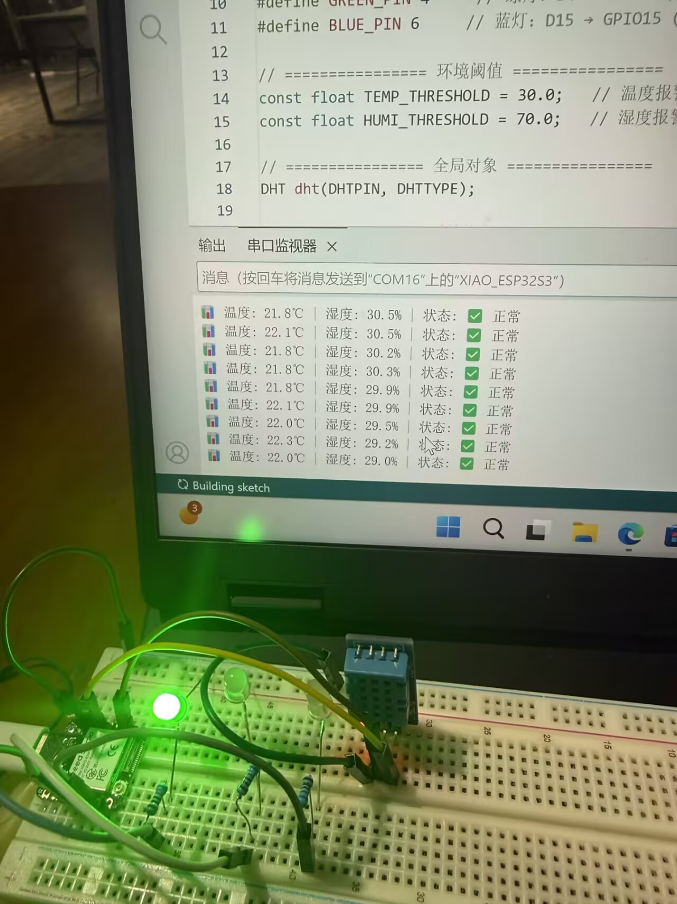

# 基于 XIAO ESP32S3 Sense 的温湿度监控系统

## 一、项目介绍

-   盾构机驾驶舱处于地下密闭作业环境，温湿度异常易影响设备运行稳定性与操作人员工作状态，而传统监测方式缺乏实时、直观的预警手段。
-   本项目面向盾构机运维人员、工程实训教学人员等目标人群，解决驾驶舱环境参数无实时反馈、超限预警不直观的核心问题。系统以微型化的 XIAO ESP32S3 Sense 为主控，搭载温湿度传感器，结合单色 LED 灯光（一号绿色常亮示正常、二号绿色闪烁示温度超限，三号绿色闪烁示湿度超限）与串口数据提示，实现环境状态的双重反馈。
-   创新点在于轻量化、低成本的硬件设计，适配驾驶舱模型与小型化安装场景，无需复杂调试即可快速部署。
    

## 二、主要功能

-   实时温湿度采集：通过温湿度传感器精准获取盾构机驾驶舱内温度、湿度数据；
-   超限智能报警：当温湿度超过预设安全阈值时，触发二三号绿色 LED 灯闪烁/亮起报警，同时串口输出超限提示信息；
-   状态可视化反馈：温湿度正常时一号绿色 LED 常亮，直观区分环境安全/异常状态；
-   数据串口输出：实时在串口打印温湿度数值、阈值信息及报警提示，便于数据追溯与调试。

## 三、工作原理

-   本系统以 XIAO ESP32S3 Sense 主控板为核心，遵循 "数据采集-逻辑判断-状态反馈" 的核心逻辑运行：首先，系统上电初始化后，温湿度传感器 DHT11 采集盾构机驾驶舱内的温湿度数据，并将模拟信号转换为数字信号传输至主控板；主控板接收数据后，先校验数据有效性，再将实时数值与预设的温湿度安全阈值进行比对。
-   若数据在安全范围内，主控板控制一号绿色 LED 常亮，同时通过串口输出实时温湿度数据；若温湿度任一参数超限，主控板立即触发报警逻辑，控制一号绿色 LED 熄灭、二三号绿色 LED 亮起；若温湿度参数均超限，二号绿色 LED 闪烁，且串口同步打印超限报警信息及具体超限参数。整个流程闭环运行，无需人工干预，可持续监测驾驶舱的环境状态。

## 四、所需组件

### （一）硬件模块

| 组件名称      | 型号/规格                      | 数量 | 功能说明         |
| ------------- | ------------------------------ | ---- | ---------------- |
| 主控开发板    | Seed Studio XIAO ESP32S3 Sense | 1    | 核心控制器       |
| 温湿度传感器  | DHT11                          | 1    | 检测环境温湿度   |
| 面包板/杜邦线 |                                | 若干 | 连接线材         |
| LED 灯        |                                | 3 个 | 显示数据是否正常 |
| 电阻          | 220Ω                           | 3 个 | 控制电流         |


### （二）软件模块

-   Arduino IDE：用于 ESP32S3 固件开发和烧录。

## 五、构建步骤

### 步骤 1：开发环境配置

-   1.1 安装 Arduino IDE 从 Arduino 官网下载最新版本 IDE，安装完成后打开软件。1.2 添加 ESP32 支持在"文件>首选项"中添加 ESP32 开发板管理器 URL：
    -   https://espressif.github.io/arduino-esp32/package_esp32_index.json
-   进入"工具>开发板>开发板管理器"，搜索"esp32"并安装最新版本。1.3 配置开发板参数选择开发板为"XIAO \_ESP32S3"，关键配置如下：
    -   Flash Mode: QIO
    -   Flash Size: 8MB
    -   PSRAM: Enabled
    -   USB CDC On Boot: Enabled
    -   CPU Frequency: 240MHz
    -   Upload Speed: 921600
    -   Core Debug Level: None

### 步骤 2：硬件连接

#### 2.1 传感器接线

-   DHT11: DATA 引脚接 GPIO7，VCC 接 3.3V，GND 接 GND
-   LED 灯（O1，O2，O3）: D2-O1-GND,D3-O2-GND,D5-O3-GND

### 步骤 3：测试温湿度传感器

#### 3.1 硬件实物图


#### 3.2 测试代码

```cpp
#include <DHT.h>

// =====================引脚配置=====================
// DHT22接在D0引脚
// 根据你的XIAO ESP32S3引脚映射：D0 → GPIO1
#define DHTPIN 1  // DHT22接在D0引脚（GPIO1）
#define DHTTYPE DHT22  // 使用DHT22传感器

// =====================创建传感器对象=====================
DHT dht(DHTPIN, DHTTYPE);

// =====================初始化=====================
void setup() {
  Serial.begin(115200);
  dht.begin();
  // 等待传感器稳定
  delay(2000);
}

// =====================主循环=====================
void loop() {
  // DHT22需要至少2秒的读取间隔
  delay(2000);

  // =====================读取数据=====================
  float humidity = dht.readHumidity();  // 读取湿度
  float temperature = dht.readTemperature();// 读取温度（摄氏度）
  float fahrenheit = dht.readTemperature(true); // 读取温度（华氏度）

  // =====================检查数据有效性=====================
  if (isnan(humidity) || isnan(temperature) || isnan(fahrenheit)) {

    // 尝试启用内部上拉电阻（辅助作用）
    pinMode(DHTPIN, INPUT_PULLUP);
    delay(100);

    return;
  }

  // =====================计算热指数（体感温度）=====================
  float heatIndex = dht.computeHeatIndex(temperature, humidity, false);

  // =====================打印数据=====================
  Serial.print("🕒 ");
  printUptime();

  Serial.print("| 🔥 ");
  Serial.print(temperature, 1); // 显示1位小数
  Serial.print("°C");

  Serial.print("| 💧 ");
  Serial.print(humidity, 1);
  Serial.print("%");

  Serial.print("| 🌡️ ");
  Serial.print(heatIndex, 1);
  Serial.print("°C");

  // =====================环境状态判断=====================
  String status = checkEnvironment(temperature, humidity);
  Serial.print("| 📊 ");
  Serial.println(status);
}

// ========================辅助函数========================

// 打印系统运行时间
void printUptime() {
  unsigned long seconds = millis() / 1000;
  unsigned long minutes = seconds / 60;
  unsigned long hours = minutes / 60;

  minutes %= 60;
  seconds %= 60;

  if (hours < 10) Serial.print("0");
  Serial.print(hours);
  Serial.print(":");
  if (minutes < 10) Serial.print("0");
  Serial.print(minutes);
  Serial.print(":");
  if (seconds < 10) Serial.print("0");
  Serial.print(seconds);
}

// 检查环境状态
String checkEnvironment(float temp, float humi) {
  // 舒适范围（室内环境）
  const float TEMP_COMFORT_MIN = 18.0;
  const float TEMP_COMFORT_MAX = 26.0;
  const float HUMI_COMFORT_MIN = 40.0;
  const float HUMI_COMFORT_MAX = 60.0;

  // 报警阈值
  const float TEMP_ALARM_HIGH = 30.0;
  const float HUMI_ALARM_HIGH = 70.0;

  // 判断状态
  if (temp >= TEMP_ALARM_HIGH && humi >= HUMI_ALARM_HIGH) {
    return "🚨 高温高湿";
  }
  else if (temp >= TEMP_ALARM_HIGH) {
    return "🔥 温度过高";
  }
  else if (humi >= HUMI_ALARM_HIGH) {
    return "💧湿度过高";
  }
  else if (temp >= TEMP_COMFORT_MIN && temp <= TEMP_COMFORT_MAX &&
           humi >= HUMI_COMFORT_MIN && humi <= HUMI_COMFORT_MAX) {
    return "✅ 舒适";
  }
  else if (temp < TEMP_COMFORT_MIN) {
    return "❄️ 温度偏低";
  }
  else if (temp > TEMP_COMFORT_MAX) {
    return "⚠️ 温度偏高";
  }
  else if (humi < HUMI_COMFORT_MIN) {
    return "☀️ 湿度过低";
  }
  else if (humi > HUMI_COMFORT_MAX) {
    return "💦 湿度偏高";
  }

  return "📊 监测中";
}
```

### 步骤 4：测试单个 LED 灯

#### 4.1 硬件实物图



#### 4.2 测试代码

```cpp
/*
 * 单LED闪烁测试
 * 接线：D4引脚 → 220Ω电阻 → LED长腿 → LED短腿 → GND
 */

#define LED_PIN 5 // D4标签对应GPIO5

void setup() {
  Serial.begin(115200);
  Serial.println("单LED闪烁测试开始");
  Serial.println("LED应接在D4引脚");

  pinMode(LED_PIN, OUTPUT);
  digitalWrite(LED_PIN, LOW); // 初始状态：灭
}

void loop() {
  Serial.println("LED亮");
  digitalWrite(LED_PIN, HIGH);
  delay(1000);

  Serial.println("LED灭");
  digitalWrite(LED_PIN, LOW);
  delay(1000);
}
```

### 步骤 5：测试全部 LED 灯

#### 5.1 硬件实物图


#### 5.2 测试代码

```cpp
#define RED_PIN 3  // D3
#define GREEN_PIN 4  // D4
#define BLUE_PIN 6  // D15

void setup() {
  Serial.begin(115200);

  pinMode(RED_PIN, OUTPUT);
  pinMode(GREEN_PIN, OUTPUT);
  pinMode(BLUE_PIN, OUTPUT);

  Serial.println("三LED独立测试开始");
  allLEDsOff();
}

void loop() {
  // 模式1：红灯单独亮
  Serial.println("模式1: 红灯亮");
  digitalWrite(RED_PIN, HIGH);
  digitalWrite(GREEN_PIN, LOW);
  digitalWrite(BLUE_PIN, LOW);
  delay(2000);

  // 模式2：绿灯单独亮
  Serial.println("模式2: 绿灯亮");
  digitalWrite(RED_PIN, LOW);
  digitalWrite(GREEN_PIN, HIGH);
  digitalWrite(BLUE_PIN, LOW);
  delay(2000);

  // 模式3：蓝灯单独亮
  Serial.println("模式3: 蓝灯亮");
  digitalWrite(RED_PIN, LOW);
  digitalWrite(GREEN_PIN, LOW);
  digitalWrite(BLUE_PIN, HIGH);
  delay(2000);
  digitalWrite(BLUE_PIN, LOW);

  // 模式4：红灯闪烁（报警模式）
  Serial.println("模式4: 红灯闪烁");
  for(int i = 0; i < 6; i++) {
    digitalWrite(RED_PIN, HIGH);
    delay(200);
    digitalWrite(RED_PIN, LOW);
    delay(200);
  }

  // 模式5：三灯流水灯
  Serial.println("模式5: 流水灯");
  for(int i = 0; i < 3; i++) {
    digitalWrite(RED_PIN, HIGH);
    delay(200);
    digitalWrite(RED_PIN, LOW);
    delay(100);
    digitalWrite(GREEN_PIN, HIGH);
    delay(200);
    digitalWrite(GREEN_PIN, LOW);
    delay(100);
    digitalWrite(BLUE_PIN, HIGH);
    delay(200);
    digitalWrite(BLUE_PIN, LOW);
    delay(100);
  }

  // 模式6：全灭
  Serial.println("模式6: 全灭");
  allLEDsOff();
  delay(2000);
}

void allLEDsOff() {
  digitalWrite(RED_PIN, LOW);
  digitalWrite(GREEN_PIN, LOW);
  digitalWrite(BLUE_PIN, LOW);
}
```

### 步骤 6：项目实现及总代码

#### 6.1 完整系统代码

```cpp
#include <DHT.h>

// ================ 引脚定义 ================
// DHT22温湿度传感器
#define DHTPIN 1        // DHT22接D0引脚 (GPIO1)
#define DHTTYPE DHT22

// LED指示灯
#define RED_PIN 4       // 红灯：D3 → GPIO4 (温度报警)
#define GREEN_PIN 5     // 绿灯：D4 → GPIO5 (环境正常)
#define BLUE_PIN 9     // 蓝灯：D9 → GPIO10 (湿度报警)

// ================ 环境阈值 ================
const float TEMP_THRESHOLD = 30.0;   // 温度报警阈值(℃)
const float HUMI_THRESHOLD = 70.0;   // 湿度报警阈值(%)

// ================ 全局对象 ================
DHT dht(DHTPIN, DHTTYPE);

// ================ 系统状态 ================
enum SystemState {
  STATE_NORMAL,      // 正常
  STATE_HIGH_TEMP,   // 高温
  STATE_HIGH_HUMI,   // 高湿
  STATE_CRITICAL,    // 高温高湿
  STATE_ERROR        // 传感器错误
};

// ================ 初始化 ================
void setup() {
  Serial.begin(115200);

  Serial.println("\n========================================");
  Serial.println("   盾构机驾驶舱环境监测系统");
  Serial.println("========================================");

  // 初始化LED引脚
  pinMode(RED_PIN, OUTPUT);
  pinMode(GREEN_PIN, OUTPUT);
  pinMode(BLUE_PIN, OUTPUT);
  allLEDsOff();

  // 初始化DHT22传感器
  dht.begin();
  delay(2000);  // 传感器启动时间

  // 系统自检
  systemSelfTest();

  Serial.println("系统就绪，开始环境监测...");
  Serial.println("----------------------------------------");
}

// ================ 主循环 ================
void loop() {
  // DHT22需要至少2秒读取间隔
  delay(2000);

  // 读取温湿度
  float temperature = dht.readTemperature();
  float humidity = dht.readHumidity();

  // 检查数据有效性
  SystemState state;
  if (isnan(temperature) || isnan(humidity)) {
    state = STATE_ERROR;
  } else {
    // 判断环境状态
    state = evaluateEnvironment(temperature, humidity);
  }

  // 显示数据和控制LED
  displayData(temperature, humidity, state);
  controlLEDs(state);
}

// ================ 环境状态评估 ================
SystemState evaluateEnvironment(float temp, float humi) {
  bool tempHigh = (temp >= TEMP_THRESHOLD);
  bool humiHigh = (humi >= HUMI_THRESHOLD);

  if (!tempHigh && !humiHigh) {
    return STATE_NORMAL;
  } else if (tempHigh && !humiHigh) {
    return STATE_HIGH_TEMP;
  } else if (!tempHigh && humiHigh) {
    return STATE_HIGH_HUMI;
  } else if (tempHigh && humiHigh) {
    return STATE_CRITICAL;
  }
  return STATE_NORMAL;
}

// ================ 显示数据 ================
void displayData(float temp, float humi, SystemState state) {
  if (state == STATE_ERROR) {
    Serial.println("❌ 传感器读取失败");
    return;
  }

  Serial.print("📊 温度: ");
  Serial.print(temp, 1);
  Serial.print("℃ | 湿度: ");
  Serial.print(humi, 1);
  Serial.print("% | 状态: ");

  switch(state) {
    case STATE_NORMAL:
      Serial.println("✅ 正常");
      break;
    case STATE_HIGH_TEMP:
      Serial.print("🔥 高温 (≥");
      Serial.print(TEMP_THRESHOLD);
      Serial.println("℃)");
      break;
    case STATE_HIGH_HUMI:
      Serial.print("💧 高湿 (≥");
      Serial.print(HUMI_THRESHOLD);
      Serial.println("%)");
      break;
    case STATE_CRITICAL:
      Serial.println("🚨 高温高湿警报");
      break;
    default:
      Serial.println("⚡ 未知状态");
  }
}

// ================ LED控制 ================
void controlLEDs(SystemState state) {
  // 先关闭所有LED
  allLEDsOff();

  switch(state) {
    case STATE_NORMAL:
      digitalWrite(GREEN_PIN, HIGH);
      break;

    case STATE_HIGH_TEMP:
      digitalWrite(RED_PIN, HIGH);
      break;

    case STATE_HIGH_HUMI:
      digitalWrite(BLUE_PIN, HIGH);
      break;

    case STATE_CRITICAL:
      // 红灯闪烁（紧急状态）
      static unsigned long lastBlink = 0;
      static bool blinkState = false;

      if (millis() - lastBlink > 300) {
        lastBlink = millis();
        blinkState = !blinkState;
        digitalWrite(RED_PIN, blinkState ? HIGH : LOW);
      }
      break;

    case STATE_ERROR:
      // 红灯快速闪烁（错误状态）
      static unsigned long lastErrorBlink = 0;
      static bool errorBlinkState = false;

      if (millis() - lastErrorBlink > 200) {
        lastErrorBlink = millis();
        errorBlinkState = !errorBlinkState;
        digitalWrite(RED_PIN, errorBlinkState ? HIGH : LOW);
      }
      break;
  }
}

// ================ 辅助函数 ================

// 系统自检
void systemSelfTest() {
  Serial.println("系统自检...");

  digitalWrite(RED_PIN, HIGH);
  delay(300);
  digitalWrite(RED_PIN, LOW);

  digitalWrite(GREEN_PIN, HIGH);
  delay(300);
  digitalWrite(GREEN_PIN, LOW);

  digitalWrite(BLUE_PIN, HIGH);
  delay(300);
  digitalWrite(BLUE_PIN, LOW);

  delay(500);
  Serial.println("自检完成");
}

// 关闭所有LED
void allLEDsOff() {
  digitalWrite(RED_PIN, LOW);
  digitalWrite(GREEN_PIN, LOW);
  digitalWrite(BLUE_PIN, LOW);
}
```

#### 6.2 代码功能说明

1. **系统架构**：采用模块化设计，包括初始化、主循环、状态评估、数据显示和 LED 控制等功能模块
2. **状态管理**：通过枚举类型定义了 5 种系统状态，实现精细化的环境监测和报警
3. **传感器接口**：使用 DHT22 传感器实现温湿度数据采集，支持数据有效性检查
4. **报警机制**：
    - 温度超过 30°C 时红灯亮起
    - 湿度超过 70%时蓝灯亮起
    - 高温高湿时红灯闪烁
    - 传感器错误时红灯快速闪烁
5. **用户界面**：串口输出带有表情符号的直观数据和状态信息
6. **系统自检**：上电时自动执行 LED 自检，确保系统正常运行

## 六、未来展望

-   基于 XIAO ESP32 S3 Sense 的温湿度监控系统目前已实现基础的温湿度采集功能，但仍有诸多可完善与优化的方向。
-   首先，硬件层面可补充蜂鸣器模块，结合温湿度阈值设置实现超限声光报警，当环境温湿度超出预设安全范围时，蜂鸣器能即时发出警示音，解决当前仅能被动查看数据、无法主动提醒的问题，提升系统的实用性与应急性。其次，网络功能亟待完善，需开发基于 Wi-Fi 的手机端交互功能，通过搭建 MQTT 通信协议或轻量级 Web 服务器，让用户在手机端实时查看温湿度数据曲线、远程修改阈值参数，还可增加数据云端存储功能，实现历史数据的追溯与分析，摆脱本地查看的局限性。

-   此外，系统精度与稳定性仍有优化空间，可引入多点温湿度采集模块，通过多传感器数据融合算法降低测量误差；同时可添加电池供电模块与低功耗模式，让设备脱离有线电源实现便携部署，适用于温室、仓储等无固定供电的场景。软件层面还可增加数据异常分析功能，通过机器学习算法识别温湿度异常波动规律，提前预判环境变化趋势，让系统从"监控"向"预警"升级，进一步拓展其在农业、工业仓储等领域的应用场景。

## 七、团队分工
陈佳蕊（软件操作与后期完善）：负责核心软件生态构建。主导Arduino IDE环境配置、库管理与代码调试；编写温湿度数据采集、阈值判断及LED报警逻辑程序；并进行系统优化与稳定性测试。

董雪蕊（前期框架与硬件连接）：负责硬件系统架构实现。完成项目整体框架设计与规划；精准连接XIAO ESP32S3、DHT11传感器及LED指示电路的硬件电路，确保其基础牢固可靠。