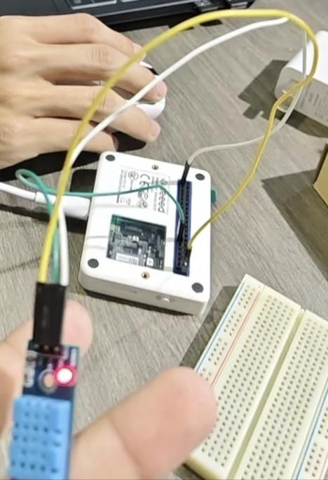

# 基于Wio Terminal的智能温湿度监控系统

## 一、项目介绍

### 项目背景
盾构机施工时，隧道内常出现40℃以上高温、90%以上高湿环境，易造成电气元件锈蚀短路、测量仪器精度下降（如导向系统误差从±3mm扩至±8mm）、液压系统效率降低等问题，严重影响施工效率与设备安全，现有大型温控系统成本高且难适配小型监测场景，因此需轻量化温湿度监控方案。

### 目标人群
盾构机施工技术人员、隧道工程设备维护人员，以及小型盾构施工项目的研发与现场管理团队。

### 解决的问题
通过Wio Terminal与DHT11传感器搭建低成本、便携的温湿度监控系统，实时采集盾构机工作区域温湿度数据，及时预警超标风险，弥补大型智能温控系统在局部区域监测的空白，降低设备因温湿度异常导致的故障概率。

### 创新点
采用低成本开源硬件组合，实现温湿度数据的实时采集与本地显示，适配盾构机狭小作业空间的轻量化监测需求；相较于传统大型温控系统，具备部署灵活、成本低廉的优势，可快速集成到盾构机局部精密部件区域的监测中。
！[项目图片](1.jpg)
## 二、主要功能

- **实时数据采集**：DHT11传感器精准采集盾构机工作区域（如主控室、刀盘、液压系统旁）的温度与湿度数据，能适配隧道内高温高湿的极端环境，为监测提供基础数据支撑。
- **数据本地显示**：Wio Terminal的显示屏可实时呈现温湿度数值，施工技术人员无需后台调取，就能直观、快速掌握现场环境参数。
- **超标预警提示**：系统可预设温湿度阈值，当数据超出盾构设备安全运行范围时，通过Wio Terminal的声光模块触发警报，及时提醒工作人员采取降温、除湿措施。
- **数据存储与追溯**：Wio Terminal支持本地数据存储，可记录一段时间内的温湿度变化曲线，便于后期分析设备故障与环境参数的关联，为施工维护提供数据依据。

## 三、工作原理

### 温湿度采集层
DHT11传感器将隧道内的湿度、温度物理量转化为电信号，并按预设频率（如每3秒）持续采集盾构机关键区域（刀盘、主控室等）的环境参数。

### 数据处理层
Wio Terminal接收传感器的模拟电信号，将电信号换算为具体的温湿度数值，并与预设的安全阈值（如温度40℃、湿度90%）进行对比。

### 输出反馈层
处理后的温湿度数据实时显示在Wio Terminal的屏幕上；若数值超出阈值，触发设备的蜂鸣器模块发出警报，同时可通过存储模块记录数据，为后续环境分析与设备维护提供依据。

## 四、所需组件

### 硬件模块

| 组件名称 | 型号/规格 | 数量 |
|---------|---------|-----|
| 主控开发板 | Wio Terminal | 1 |
| 温湿度传感器 | DHT11 | 1 |
| 电源模块 | 5V/3A | 1 |
| 面包板/杜邦线 | (公对母) | 3 |

### 软件模块

- **Arduino IDE**：用于Wio Terminal的固件开发和建立传感器与开发板的通信协议

## 五、构建步骤

### 步骤一：开发环境的配置

- 安装Arduino IDE：从Arduino官网下载最新版本IDE，安装完成后打开软件。
- 打开Arduino IDE，"文件→首选项"，附加开发板URL填：https://files.seeedstudio.com/arduino/package_seeeduino_boards_index.json
- 随后依次点击 "工具→开发板→开发板管理器"，搜索 "Wio Terminal" 安装 "Seeed SAMD Boards" 板包。
- 然后在Arduino IDE主页，点击 "选择开发板"，选择 "Seeeduino Wio Terminal" (注：此步骤需要将Wio Terminal与电脑连接)

### 步骤二：硬件连接

- Wio Terminal通过USB-C数据线与电脑连接，电源拨至ON，蓝色LED亮即供电正常；
- 用杜邦线将DHT11传感器与Wio Terminal连接起来，引脚配置如下：
  "VCC" → "3.3V" 或 "5V"
  "DATA" → "D2"
  "GND" → "GND"

### 步骤三：创建配置文件

以上步骤进行完后，将代码编辑区的代码清空，输入代码：

```cpp
#include <TFT_eSPI.h>
#include <DHT.h>

// 引脚定义
#define DHTPIN 0        // DHT11连接到D0引脚
#define DHTTYPE DHT11
#define BUZZER_PIN WIO_BUZZER   // Wio Terminal蜂鸣器引脚

DHT dht(DHTPIN, DHTTYPE);
TFT_eSPI tft;

// 颜色定义
#define TEMP_HIGH_COLOR TFT_RED
#define HUMI_HIGH_COLOR TFT_YELLOW
#define TEMP_NORMAL_COLOR TFT_GREEN
#define TEMP_LOW_COLOR TFT_BLUE
#define TITLE_COLOR TFT_CYAN
#define TEXT_COLOR TFT_WHITE

// 报警状态
bool tempAlarm = false;
bool humiAlarm = false;
unsigned long lastBeepTime = 0;
unsigned long beepInterval = 1000;
bool beepState = false;

// 紧急报警音乐（更高音调，更急促）
char emergencyMelody[] = "CCCCaaaGGGGeee ";  // 高音调警报
int emergencyBeats[] = { 1, 1, 1, 1, 1, 1, 1, 1, 1, 1, 1, 1, 1, 1, 1, 1 };
int emergencyTempo = 200;  // 更快的节奏
int emergencyNoteIndex = 0;

// 音符频率定义（高音区，声音更大）
char noteNames[] = { 'c', 'd', 'e', 'f', 'g', 'a', 'b', 'C', 'D', 'E', 'F', 'G', 'A', 'B', 'c' };
int noteFrequencies[] = {
  1915, 1700, 1519, 1432, 1275, 1136, 1014,  // 中音区
  956, 851, 758, 716, 637, 568, 507            // 高音区（频率更低，音调更高）
};

void setup() {
  Serial.begin(115200);

  // 初始化蜂鸣器
  pinMode(BUZZER_PIN, OUTPUT);
  digitalWrite(BUZZER_PIN, LOW);

  // 初始化屏幕
  tft.begin();
  tft.setRotation(3);
  tft.fillScreen(TFT_BLACK);

  // 显示标题
  displayTitle();

  // 初始化DHT传感器
  dht.begin();

  // 播放测试音（更大声）
  playLoudTestTone();

  delay(2000);
}

void loop() {
  delay(2000);

  float humidity = dht.readHumidity();
  float temperature = dht.readTemperature();

  if (isnan(temperature) || isnan(humidity)) {
    Serial.println("读取DHT11失败！");
    displayError();
    stopAlarm();
    return;
  }

  Serial.print("温度: ");
  Serial.print(temperature, 1);
  Serial.print("°C, 湿度: ");
  Serial.print(humidity, 1);
  Serial.println("%");

  // 检查报警条件
  checkAlarmConditions(temperature, humidity);
  // 控制报警声音
  controlAlarm();
  // 显示数据
  displayOnScreen(temperature, humidity);
  displayAlarmStatus(temperature, humidity);
}

void displayTitle() {
  tft.setTextColor(TITLE_COLOR, TFT_BLACK);
  tft.setTextSize(3);
  tft.drawString("温湿度监测", 69, 10);

  tft.setTextSize(2);
  tft.setTextColor(TEXT_COLOR, TFT_BLACK);
  tft.drawString("紧急报警系统", 60, 50);

  // 显示状态说明
  tft.setTextSize(1);
  tft.setTextColor(TEMP_HIGH_COLOR, TFT_BLACK);
  tft.drawString(">40°C:红+警报", 10, 220);

  tft.setTextColor(HUMI_HIGH_COLOR, TFT_BLACK);
  tft.drawString(">90%:黄+警报", 110, 220);

  tft.setTextColor(TEMP_NORMAL_COLOR, TFT_BLACK);
  tft.drawString("音量:最大", 210, 220);
}

void checkAlarmConditions(float temp, float hum) {
  bool prevTempAlarm = tempAlarm;
  bool prevHumiAlarm = humiAlarm;

  tempAlarm = (temp > 40.0);
  humiAlarm = (hum > 90.0);

  if (tempAlarm && !prevTempAlarm) {
    Serial.println("        高温紧急报警！温度超过40°C");
    Serial.println("播放紧急报警音...");
    emergencyNoteIndex = 0;
  }
  if (humiAlarm && !prevHumiAlarm) {
    Serial.println("        高湿紧急报警！湿度超过90%");
    Serial.println("播放紧急报警音...");
    emergencyNoteIndex = 0;
  }

  if ((tempAlarm != prevTempAlarm) || (humiAlarm != prevHumiAlarm)) {
    playEmergencyAlert();
  }
}

void controlAlarm() {
  unsigned long currentTime = millis();

  if (tempAlarm || humiAlarm) {
    // 根据报警类型设置不同的播放间隔
    if (tempAlarm && humiAlarm) {
      beepInterval = 300;  // 双报警：极快速播放
    } else if (tempAlarm) {
      beepInterval = 500;  // 高温报警：快速播放
    } else if (humiAlarm) {
      beepInterval = 700;  // 高湿报警：中等速度
    }

    if (currentTime - lastBeepTime >= beepInterval) {
      // 播放紧急报警音
      playEmergencySound();
      lastBeepTime = currentTime;

      // 显示报警状态（闪烁）
      static bool alertBlink = false;
      alertBlink = !alertBlink;
      if (alertBlink) {
        tft.fillRect(280, 220, 30, 10, TFT_RED);
        tft.setTextColor(TFT_YELLOW, TFT_RED);
        tft.setTextSize(1);
        tft.setCursor(282, 221);
        tft.print("警");
      } else {
        tft.fillRect(280, 220, 30, 10, TFT_BLACK);
      }
    }
  } else {
    // 没有报警，停止声音
    digitalWrite(BUZZER_PIN, LOW);
    emergencyNoteIndex = 0;

    // 清除报警状态显示
    tft.fillRect(280, 220, 30, 10, TFT_BLACK);
  }
}

// ============ 紧急报警声音函数 ============
void playLoudTestTone() {
  Serial.println("播放最大音量测试音...");
  // 播放高音调大音量测试音
  playLoudTone(800, 500);  // 高频率，长时间
  delay(300);
  playLoudTone(1000, 300);  // 更高频率
  delay(200);
  playLoudTone(1200, 200);  // 最高频率
  digitalWrite(BUZZER_PIN, LOW);
}

void playEmergencyAlert() {
  Serial.println("播放紧急警报提示音");
  // 三个急促的高音
  for (int i = 0; i < 3; i++) {
    playLoudTone(1500, 100);  // 极高频
    delay(80);
  }
  digitalWrite(BUZZER_PIN, LOW);
}

void playEmergencySound() {
  // 交替播放高低音，模拟警笛效果
  static bool highTone = true;
  if (highTone) {
    playLoudTone(1200, 150);  // 高音
  } else {
    playLoudTone(800, 150);  // 低音
  }
  highTone = !highTone;
}

void playLoudTone(int frequency, int duration) {
  // 使用更高占空比让声音更大
  long period = 1000000L / frequency;  // 周期（微秒）
  long halfPeriod = period / 2;
  long cycles = duration * 1000L / period;

  for (long i = 0; i < cycles; i++) {
    digitalWrite(BUZZER_PIN, HIGH);
    delayMicroseconds(halfPeriod);
    digitalWrite(BUZZER_PIN, LOW);
    delayMicroseconds(halfPeriod);
  }
}

// 原始的音乐播放函数（保留但修改为更大声）
void playLoudNote(char note, int duration) {
  // 播放音符将对应更大声
  for (int i = 0; i < 14; i++) {
    if (noteNames[i] == note) {
      // 使用更低频率值（对应更高调）并增加音量
      int adjustedFreq = noteFrequencies[i] * 0.8;  // 提高音调
      playLoudTone(adjustedFreq, duration);
      return;
    }
  }
}

void stopAlarm() {
  tempAlarm = false;
  humiAlarm = false;
  digitalWrite(BUZZER_PIN, LOW);
  emergencyNoteIndex = 0;
}

// ============ 显示函数 ============
void displayOnScreen(float temp, float hum) {
  tft.fillRect(0, 80, 320, 160, TFT_BLACK);

  // 显示温度
  tft.setTextSize(3);
  tft.setCursor(20, 99);
  tft.setTextColor(TEXT_COLOR, TFT_BLACK);
  tft.print("温度: ");

  if (tempAlarm) {
    tft.setTextColor(TEMP_HIGH_COLOR, TFT_BLACK);
    // 红色强烈闪烁效果
    static int blinkCount = 0;
    blinkCount++;
    if (blinkCount % 3 == 0) {
      tft.fillRect(159, 99, 80, 35, TFT_RED);
    }
  } else if (temp < 15.0) {
    tft.setTextColor(TEMP_LOW_COLOR, TFT_BLACK);
  } else {
    tft.setTextColor(TEMP_NORMAL_COLOR, TFT_BLACK);
  }

  tft.print(temp, 1);
  tft.setTextColor(TEXT_COLOR, TFT_BLACK);
  tft.print(" °C");

  // 显示湿度
  tft.setCursor(20, 130);
  tft.setTextColor(TEXT_COLOR, TFT_BLACK);
  tft.print("湿度: ");
  if (humiAlarm) {
    tft.setTextColor(HUMI_HIGH_COLOR, TFT_BLACK);
  } else {
    tft.setTextColor(TEMP_NORMAL_COLOR, TFT_BLACK);
  }
  tft.print(hum, 1);
  tft.setTextColor(TEXT_COLOR, TFT_BLACK);
  tft.print(" %");
}

void displayAlarmStatus(float temp, float hum) {
  tft.fillRect(0, 200, 320, 20, TFT_BLACK);
  tft.setTextSize(1);
  tft.setCursor(10, 210);
  tft.setTextColor(TEXT_COLOR, TFT_BLACK);
  
  if (tempAlarm && humiAlarm) {
    tft.print("双报警: 温度");
    tft.setTextColor(TEMP_HIGH_COLOR, TFT_BLACK);
    tft.print(" >40°C");
    tft.setTextColor(TEXT_COLOR, TFT_BLACK);
    tft.print(" + 湿度");
    tft.setTextColor(HUMI_HIGH_COLOR, TFT_BLACK);
    tft.print(" >90%");
  } else if (tempAlarm) {
    tft.print("温度报警: ");
    tft.setTextColor(TEMP_HIGH_COLOR, TFT_BLACK);
    tft.print("温度 >40°C");
  } else if (humiAlarm) {
    tft.print("湿度报警: ");
    tft.setTextColor(HUMI_HIGH_COLOR, TFT_BLACK);
    tft.print("湿度 >90%");
  } else {
    tft.print("正常: 温度 ");
    tft.setTextColor(TEMP_NORMAL_COLOR, TFT_BLACK);
    tft.print("<40°C");
    tft.setTextColor(TEXT_COLOR, TFT_BLACK);
    tft.print(" + 湿度 ");
    tft.setTextColor(TEMP_NORMAL_COLOR, TFT_BLACK);
    tft.print("<90%");
  }
}

void displayError() {
  tft.fillRect(0, 80, 320, 160, TFT_BLACK);
  tft.setTextSize(2);
  tft.setCursor(60, 120);
  tft.setTextColor(TFT_RED, TFT_BLACK);
  tft.print("传感器连接失败!");
  tft.setCursor(80, 150);
  tft.setTextSize(1);
  tft.print("请检查接线!");
}
```

## 六、未来展望

1. **数据采集精度优化**：当前采用的 DHT11 传感器在极端环境下的测量精度有提升空间，未来可替换为 DHT22 或 SHT30 等高精度传感器，进一步降低温湿度测量误差，同时增加气压、粉尘浓度等关键环境参数的采集模块，构建更全面的隧道施工环境监测体系，为设备运行和人员安全提供多维度数据支撑。

2. **远程监测与云端协同**：搭建云端数据管理平台，通过 Wi-Fi 或 LoRa 模块为 Wio Terminal 增加无线通信功能，实现温湿度数据的实时上传与远程访问。施工管理人员可通过手机 APP、电脑网页端随时随地查看隧道内各监测点数据，接收预警通知，无需抵达现场即可掌握环境状态，提升管理效率。

3. **预警机制智能化迭代**：现有预警仅基于固定阈值触发，后续可引入机器学习算法，结合历史施工数据、设备运行状态数据，建立动态阈值模型。通过分析温湿度变化趋势预判潜在风险，实现从 "超标报警" 到 "提前预警" 的升级，例如当温湿度在短时间内快速攀升时，提前触发预警并给出针对性处理建议。
