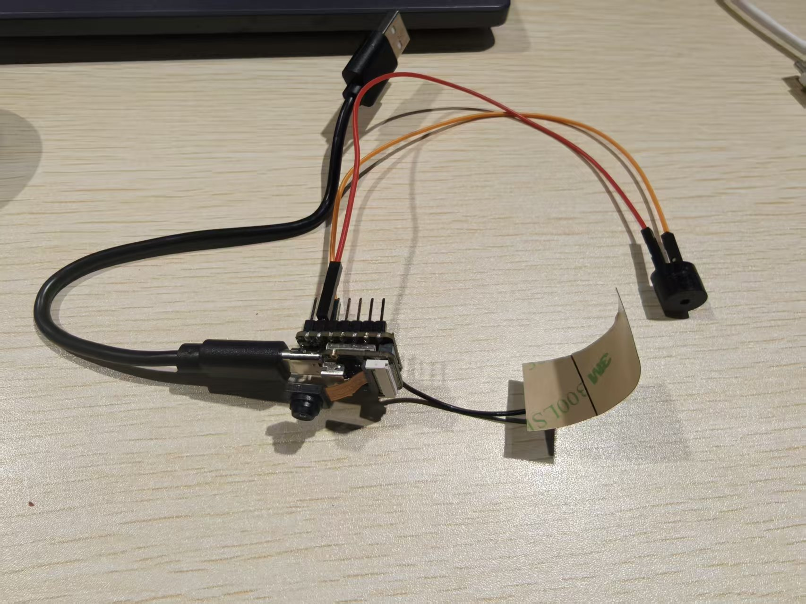

# 基于XIAO ESP32S3 Sense与WIO Terminal的智能舱门监测系统

## 一、项目介绍

- 本项目基于XIAO ESP32S3 Sense开发板与WIO Terminal，构建了一套完整的盾构机人仓舱门监测系统。该系统集成实时视频监控，自动报警与LCD提示的功能，通过WiFi连接实现设备之间的信息传递，同时使用SenseCraft AI平台进行视觉AI的开发训练，达到无需复杂编程即可快速部署AI视觉识别功能。
- 目前仅实现了wio terminal的蜂鸣器与LCD报警预警，XIAO esp32 sense的视觉分类AI模块的开发以及云服务器的搭建，测试了XIAO esp32 sense以GPIO实现蜂鸣器的报警

## 二、主要功能

- **视频监测**：采用视觉AI模块，自动识别盾构机人仓舱门的开关状态；
- **自动报警**：根据AI智能识别结果，WIO Terminal自主实现报警与屏幕播报。

## 三、工作原理

### 硬件层

- **XIAO ESP32 S3 Sense**：作为前端传感器单元，负责采集环境信息（如舱门开闭状态）。该设备集成了摄像头模块，能够通过图像识别技术判断舱门是否开启。
- **Wio Terminal**：作为后端报警单元，包含显示屏和蜂鸣器。一旦接收到报警信号，将立即在屏幕上显示报警信息并发出声音警报。

### 通信层

- 使用EMQX Cloud部署的MQTT服务进行数据传输。当XIAO设备检测到舱门开启时，会向指定主题`sensor/door_status`发布一条消息，内容为"open"或"close"。
- Wio Terminal订阅同一主题`sensor/door_status`，监听来自XIAO的消息。一旦接收到"open"的消息，即触发报警机制。

### 应用层

- **SenseCraft**：用于配置XIAO设备的行为逻辑，包括何时以及如何发送MQTT消息。
- **Arduino IDE**：编写并上传代码至Wio Terminal，使其能够正确接收MQTT消息，并执行相应的报警操作。

## 四、所需组件

### （一）硬件模块

| 组件名称 | 型号/规格 | 数量 | 功能说明 |
|---------|----------|------|---------|
| 主控单元 | Seeed Studio XIAO ESP32S3 Sense | 1 | 负责图像采集与AI判断。 |
| 报警提醒设备（1） | 蜂鸣器 | 1 | 负责声音提醒报警 |
| 报警提醒设备（2） | Wio Terminal | 1 | 负责声音报警与LCD提醒 |
| USB-C线 | 标准线 | 若干 | 为XIAO和Wio Terminal供电及上传程序 |
| 杜邦线 | 双母头 | 若干 | 设备间的通信连接 |



### （二）软件模块

- **Arduino IDE**：用于ESP32固件开发和程序烧录，编写XIAO和Wio Terminal的控制代码；
- **SenseCraft AI**：AI模型训练与部署平台，用于配置XIAO的图像识别模型（舱门开闭检测）；
- **EMQX Cloud**：基于MQTT协议的物联网云平台，实现设备间的消息发布与订阅，作为XIAO与Wio Terminal的通信中枢；
- **MQTT Explorer/浏览器脚本**：用于测试和保活EMQX部署，确保服务持续可用；
- **PubSubClient库**：在Wio Terminal上使用的MQTT客户端库，实现对`sensor/door_status`主题的订阅与消息处理；
- **Seed_Arduino_LCD / TFT_eSPI**：用于驱动Wio Terminal的显示屏，实现报警信息的图形化展示；
- **Seed_Arduino_Speaker**：用于控制Wio Terminal内置蜂鸣器，生成报警音效。

## 五、构建步骤

### 步骤一：Arduino IDE的安装及其配置

#### 1.1 安装Arduino IDE

访问https://www.arduino.cc/en/software从Arduino官网下载最新版本IDE，安装完成后打开软件

#### 1.2 首次启动时配置：

- 开发板管理器: "Seed Wio Terminal"
- 端口: 选择对应COM端口
- 首选项配置：
  - https://files.seeedstudio.com/arduino/package_seeeduino_boards_index.json，
  - https://raw.githubusercontent.com/espressif/arduino-esp32/gh-pages/package_esp32_index.json
- 添加库：
  - 工具 → 管理库
  - 搜索安装：
    - "TFT_eSPI" by Bodmer (v2.5.41)
    - "PubSubClient" by Nick O'Leary (v2.8)
    - "WiFiNINA" by Arduino (v1.8.13)
    - "Seeed Arduino Speaker" by Seeed Studio (v1.0.4)

### 步骤二：云平台搭建

#### 2.1 创建账户：

- 访问https://cloud.emqx.com并使用GitHub账号登录
- 创建部署：
  1. 点击"Create Deployment"
  2. 选择"Serverless"计划
  3. 区域选择"Asia Pacific (Singapore)"
  4. 点击"Confirm and Create"
  5. 等待直至状态变为"Running"

#### 2.2 配置认证：

- 进入部署 → Authentication
- 点击"Create Authentication"
- 选择"Password-Based"
- 填写：
  - Username: door_monitor
  - Password: Door123! (需包含大写+数字+符号)
  - Tags: door_alarm_system
- 点击"Create"

#### 2.3 获取连接参数：

- WebSocket地址: wss://[部署ID].ala.asia-southeast1.emqxsl.com:8084/mqtt
  (例: wss://m1281106.ala.asia-southeast1.emqxsl.com:8084/mqtt)
- 用户名: door_monitor
- 密码: Door123!
- 主题: sensor/door_status

### 步骤三：XIAO设备配置

#### 3.1 视觉AI部署

- 连接设备
  - 打开SenseCraft AI平台（https://sensecraft.seeed.cc/ai/），使用Type-C数据线将XIAO ESP32S3 Sense连接到电脑。在平台右上角选择"XIAO ESP32S3 Sense"，点击"Connect"连接设备。
- 数据采集
  - 创建分类识别项目，设置类别（"opened"与"closed"）。对准摄像头采集每个类别的图像数据，每个类别建议采集30张以上不同角度的图片。
- 模型训练
  - 点击"开始训练"，设置训练参数：
    - 训练周期：50
    - 批次大小：16
    - 学习率：0.001
  - 等待训练完成
- 模型部署
  - 训练完成后，点击"部署到设备"，选择XIAO ESP32S3 Sense设备，等待模型上传完成。
  - 部署成功后即可在摄像头预览中看到识别结果。

#### 3.2 (MQTT配置)

- 进入"Actions"标签页
- 点击"Add Action"→选择"MQTT"
- 填写参数：
  - Broker: [您的EMQX地址]
  - Port: 8084
  - Username: door_monitor
  - Password: Door123!
  - Topic: sensor/door_status
  - Payload:
    ```
    
    {"status": "open", "confidence": {{ predictions[0].score }} }
    
    ```
- 触发条件: 当检测到"door_open"且置信度 > 0.85

#### 3.3 蜂鸣器连接

- 使用杜邦线连接蜂鸣器与xiao esp32 sense
- 连接方式：
  - 蜂鸣器负极 → GND
  - 蜂鸣器正极 → D0

### (步骤四：Wio Terminal编程)

#### 4.1 代码实现

```cpp
#include <TFT_eSPI.h>
#include <WiFiNINA.h>
#include <PubSubClient.h>
#include <Seed_Arduino_Speaker.h>

// EMQX 配置
const char* mqtt_server = "m1281106.ala.asia-southeast1.emqxsl.com";
const int mqtt_port = 8084;
const char* mqtt_user = "door_monitor";
const char* mqtt_pass = "Door123!";
const char* topic = "sensor/door_status";

// WiFi 配置
char ssid[] = "YOUR_WIFI_SSID";
char pass[] = "YOUR_WIFI_PASSWORD";

TFT_eSPI tft;
WiFiClient wifiClient;
PubSubClient mqttClient(wifiClient);

void setup() {
  Serial.begin(115200);
  tft.init();
  tft.setRotation(3);
  pinMode(WIO_BUZZER, OUTPUT);

  // 连接 WiFi
  WiFi.begin(ssid, pass);
  while (WiFi.status() != WL_CONNECTED) {
    delay(500);
    Serial.print(".");
  }

  // 连接 MQTT
  mqttClient.setServer(mqtt_server, mqtt_port);
  mqttClient.setCallback(mqttCallback);
  mqttConnect();

  // 显示初始化成功
  tft.fillScreen(TFT_BLACK);
  tft.setTextColor(TFT_GREEN);
  tft.setTextSize(2);
  tft.setCursor(20, 100);
  tft.println("SYSTEM READY");
}

void mqttConnect() {
  while (!mqttClient.connected()) {
    if (mqttClient.connect("WioTerminal_Alarm", mqtt_user, mqtt_pass)) {
      Serial.println("MQTT Connected");
      mqttClient.subscribe(topic);
    } else {
      delay(5000);
    }
  }
}

void mqttCallback(char* topic, byte* payload, unsigned int length) {
  String msg = "";
  for (int i = 0; i < length; i++) {
    msg += (char)payload[i];
  }

  if (msg.indexOf("open") != -1) {
    triggerAlarm();
  }
}

void triggerAlarm() {
  // 声光警报
  tft.fillScreen(TFT_RED);
  tft.setTextColor(TFT_WHITE);
  tft.setTextSize(4);
  tft.setCursor(110, 80);
  tft.print("!!!");

  tft.setTextSize(2);
  tft.setCursor(40, 200);
  tft.println("DOOR OPEN!");

  // 蜂鸣器警报
  for (int i = 0; i < 3; i++) {
    analogWrite(WIO_BUZZER, 128); delay(100);
    analogWrite(WIO_BUZZER, 0); delay(50);
    analogWrite(WIO_BUZZER, 128); delay(100);
    analogWrite(WIO_BUZZER, 0); delay(50);
    analogWrite(WIO_BUZZER, 200); delay(300);
    analogWrite(WIO_BUZZER, 0); delay(200);
  }
}

void loop() {
  if (!mqttClient.connected()) {
    mqttConnect();
  }
  mqttClient.loop();

  // 每5分钟发送心跳
  static unsigned long lastHeartbeat = 0;
  if (millis() - lastHeartbeat > 300000) {
    mqttClient.publish("system/heartbeat", "alive");
    lastHeartbeat = millis();
  }
}
```

#### 4.2 关键代码替换

- 替换 WiFi 凭证:
  - `char ssid[]="YOUR_WIFI_SSID";`
  - `char pass[]="YOUR_WIFI_PASSWORD";`
- 验证 EMQX 地址:
  - `const char* mqtt_server = "m1281106.ala.asia-southeast1.emqxsl.com";`
- 上传代码:
  - 点击 Arduino IDE 上传按钮
  - 观察串口监视器 (115200 baud) 显示 "MQTT Connected"

### 步骤五：设备维护

- 每月1次: 检查电池电量，检查电池电量，清洁 XIAO 摄像头镜片
- 每半年: 更新 Arduino 库
- 故障代码:
  - E101: 网络中断 → 重启路由器
  - E205: MQTT 失败 → 重新保活部署
  - E307: 摄像头离线 → 重插 XIAO USB

## 六、未来展望

- 对于该项目还存在以下待改进方向
  - Wio terminal 的wifi连接与XIAO ESP32 Sense 的wifi式数据通讯以及UART通讯
  - Xiao esp32 sense 的模型与传令代码的共同烧录
  - 实际可用的产品开发: 未来将整个功能封装集成为一个安装方便，系统稳定的设备
  - 实现XIAO esp32 snes监控视频的上传备份
  - 手机app与网页端访问云端服务器读取前一天视频监控画面

## 七、项目贡献者

- 项目成员： 李家奇  龚伟
